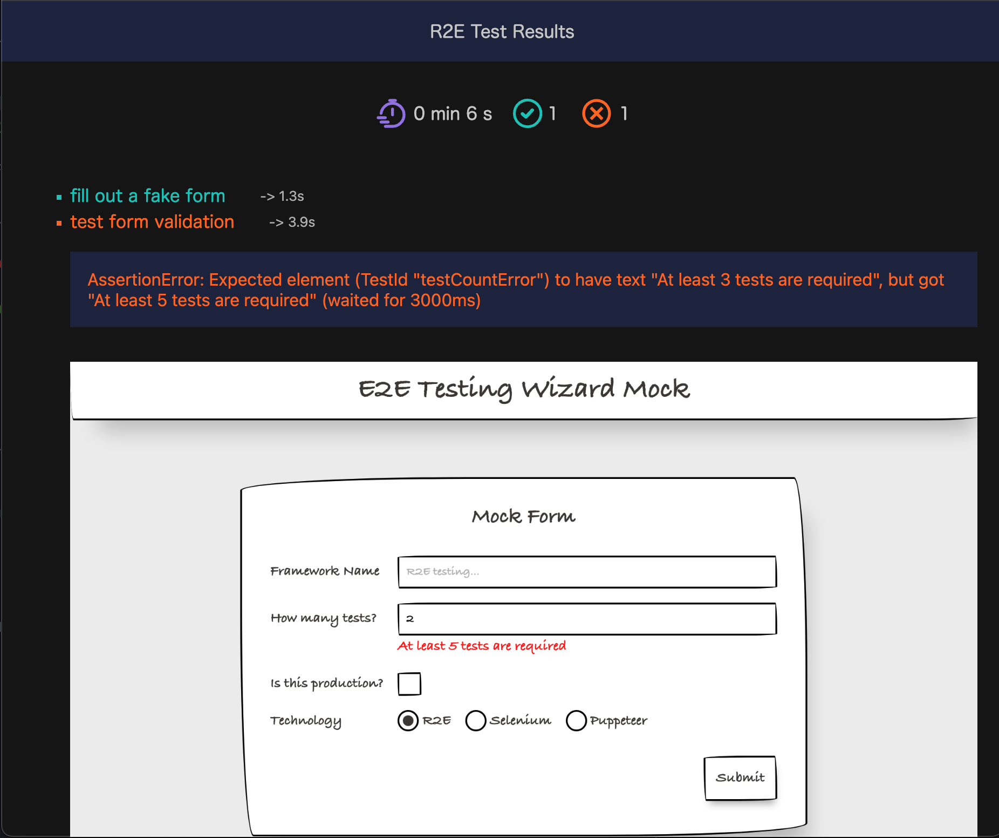

# R2E Platform

E2E testing in Roc!

Docs: https://adomurad.github.io/r2e-platform/

Tutorial: https://adomurad.github.io/r2e-platform/Tutorial

Releases: https://github.com/adomurad/r2e-platform/releases

Example Repo: https://github.com/adomurad/r2e-platform-example

## Warning

This platform downloads ~150MB at the first start - "chrome for testing" and
chromedriver.

## Showcase


Present the results in one of the predefined formats, or create you own
reporters:



## Support

Currently only supported target is chrome.

Running R2E Platform is possible only on:

- Linux x64
- MacOS arm
- MacOS x64

Tested only on:

- Linux x64
- MacOS arm

## Example:

```roc
app [testCases, config] { r2e: platform "https://github.com/adomurad/r2e-platform/releases/download/0.8.0/o-YITMnvpJZg-zxL2xKiCxBFlJzlEoEwdRY5a39WFZ0.tar.br" }

import r2e.Test exposing [test]
import r2e.Config
import r2e.Debug
import r2e.Browser
import r2e.Element
import r2e.Assert

config = Config.defaultConfig

testCases = [test1]

test1 = test "use roc repl" \browser ->
    # go to roc-lang.org
    browser |> Browser.navigateTo! "http://roc-lang.org"
    # find repl input
    replInput = browser |> Browser.findElement! (Css "#source-input")
    # wait for the repl to initialize
    Debug.wait! 200
    # send keys to repl
    replInput |> Element.inputText! "0.1+0.2{enter}"
    # find repl output element
    outputEl = browser |> Browser.findElement! (Css ".output")
    # get output text
    outputText = outputEl |> Element.getText!
    # assert text - fail for demo purpose
    outputText |> Assert.shouldBe "0.3000000001 : Frac *"
```

## Local Development

```sh
roc build.roc
```

```sh
roc --prebuilt-platform app.roc
```

## Compatibility

To build this, you will need:

- zig
- golang
